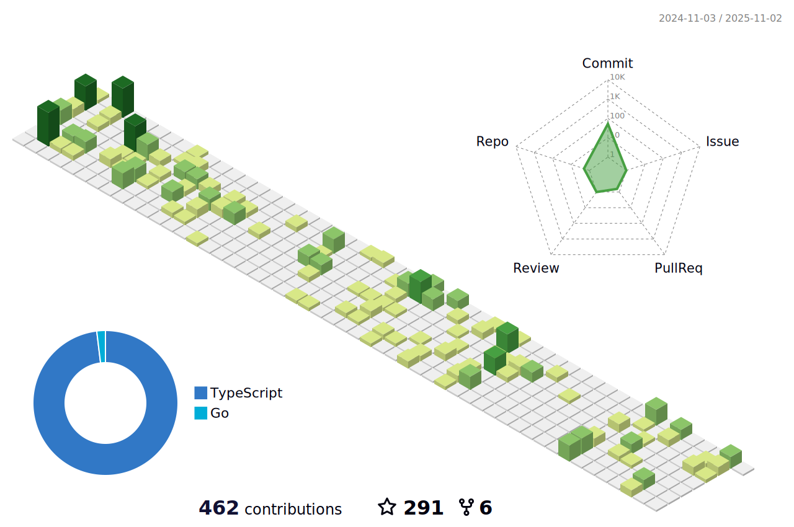

<h1 align="center">Oi 👋, eu sou o Bruno Marques </h1>

### Sou desenvolvedor front-end no Brasil
	

- 🍁 Atualmente estou armado com: **TypeScript, React, NextJS, NodeJS e SQL**
- 🌱 Estou atualmente focado em: **Node, ORMs, Clean Code e TDD**

- 📫 Como chegar até mim:
	**[e-Mail](blmarques.dev@gmail.com)**  **[Linkedin](https://linkedin.com/in/00brunomarques)**

##

 

<a href="https://github.com/blmarquess">

 
 

</a>

	
##

 

              
      
	
	
### __🖥️ My DevSetup__  
	

 
	 

	
 
 
 
 
 
	

 
	 <a href="https://github.com/blmarquess">
		 
<h3 align="left">🛠 Stack Favorita:</h3>

		 
###

		 

    
    
    
    
        
      
      
      
      
      
      
	
##
	
	
 
 
 
 
	

  

 
		  

</a>
	

		

		

	

